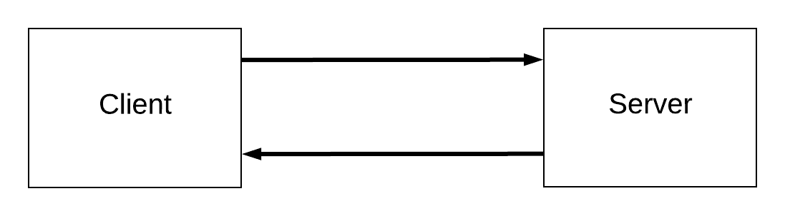

# Intro to Express

Today is a big day in WDI! We've build front-end applications using our knowledge and expertise of HTML, CSS and JavaScript. Over the next few weeks we're going to venture in to new territory: building full-stack applications!

The framework we're going to learn for building full-stack applications is called Express. We're going to use it to build feature-rich applications, like the ones you often use: Spotify, Facebook, Twitter, etc. We'll learn how these applications are able to handle requests from users, save data to a database and then process that data before displaying it to the users. If you have a startup idea or an idea for an application, you're about two weeks away from being able to build it!

Before we get to that, let's learn a little more about how the internet works and how Express fits in to building full-stack applications.

## Objectives

By the end of this lesson, developers should be able to:

- Explain and understand the request-response cycle
- Discuss how the internet works including:
  - Browser requests
  - Status codes
  - HTTP methods and REST
- Build a simple server-side application with Express

## Introduction

Express is a framework for building web applications.

What does that mean?

In development, a framework is a collection of tools, patterns, and conventions that let you perform some task quickly and efficiently. There are lots of different kinds of frameworks for different kinds of tasks. There are frameworks for building command line applications, frameworks for deploying applications to the cloud, and frameworks for running tests against an application to make sure everything is working as it's supposed to.

Express is a framework for building web applications, meaning it's a set of tools, patterns, and conventions for building applications for the internet. It works within the confines of the internet so that when you navigate to a URL in your browser, an app built with Express can handle that URL and send you some response (like an HTML file).

## How does the Internet Work

Before we can build our first full-stack application, we need to discuss how the internet works. Once we know a little bit about how the internet works, we can start to think about how Express (our back-end) fits in with our front-end.

### Client-Server

The internet follows a model of communication called `client-server`. Your browser is the `client`, used for navigating and interacting with the web. While our browsers exist on our computers or phones, the internet does not! Our browsers are portals to the internet. The other side of the equation is the `server` - a computer somewhere that stores and *serves* webpages.



The client and server communicate using `http` and the `request-response` cycle.

### HTTP

HTTP stands for **Hyper-Text Transfer Protocol**. If the client and server communicate, then HTTP is the structure of that communication. HTTP dictates how the client requests information from a server and how the server responds. Each message is similarly formatted - so you can think of them as like electronic telegrams.

Requests always have these three parts:

1. Request line (including the URL and the HTTP Method)
1. Request header (additional information about the request and what we expect in the response)
1. Body message (optional - things like form data)

Responses in turn always have these three parts:

1. Status (a status code indicating how the request was handled)
1. Response header (additional information about the response)
1. Body message (optional - an html document, JSON, XML)

Clients make requests to a location (called a URL) using a method. There are 10 possible HTTP methods, but only 5 that are important:

| Method Name | Description |
| --- | --- |
| GET | Used for retrieving data from a server. |
| POST | Used for sending data to the server. |
| PUT | Used for replacing data on the server. |
| PATCH | Used for updating data on the server. |
| DELETE | Used for deleting data from the server. |

Browsers have only implemented GET and POST, the rest we need to do using JavaScript or find some kind of work-around.

When the server receives a request, it processes the message and then sends a response. The server always sends a response, though sometimes that response is just to tell the client that there was an error. Generally, the response will be an HTML document.

#### How does it actually work

When you type a URL in the navigation bar of your browser, you make a GET request to that URL (i.e. `http://www.google.com`). The server receives that message and formulates a response: a 200 status code (to indicate everything worked out just fine) and an HTML document for the Google home page.

When you click on a link, you're making a GET request to a URL, just like when you type the URL in the navigation bar of your browser. The server receives the request and sends a response with a new HTML document for you.

When you submit a form, you make a POST request to a URL defined in the `action` attribute of the `<form>` element. The fields in the form become the request body. The server processes the request (typically saving the request body to a database) and then sends a response.

### Why do we care

When the internet was first created, you would request a document that already existed (in full) on the server. So when you typed in `http://www.timberners-lee.com`, you received an HTML document on Tim's server. If you wanted to see the about page on Tim's website, you would navigate to `http://www.timberners-lee.com/about.html`. The important thing to note is that someone wrote those HTML pages in full and by hand.

That worked well when the internet was just used for sharing scientific documents. Back then, websites weren't backed by databases and didn't need to dynamically retrieve content like they do now.

Imagine you have a website for your cats. Each of your 10 cats has a page on the site:

- `www.cat-astrophy.com/whiskers.html`
- `www.cat-astrophy.com/mr-fuzzy-pants.html`
- `www.cat-astrophy.com/purrrasaurus-rex.html`
- `www.cat-astrophy.com/walter.html`
- ...

You would have to make a full HTML document for each page. None of the HTML would change from page to page, but the information inside of that HTML would - because it was unique to each cat.

What a load of work! We don't have time for that! We're programmers!

> True story: this is why PHP was created.

Instead of writing all that HTML by hand, lets build and use tools that make it so we can dynamically retrieve content and "fill in" an HTML document like a template. That is exactly what Express and any other web framework does!

When we use Express, we don't need to have a `whiskers.html` file on our server - we just need to have all our information about whiskers in our database. Then when someone makes a GET request to `ww.cat-astrohpy.com/whiskers`, our server-side application (built with Express) will see that the request contains `whiskers` inside of it, pull the data about whiskers from the database and dynamically render and send an HTML document with that data.

So much easier!

## Express

Express is a minimalistic web framework. Compared to web frameworks like Django and Ruby on Rails, Express is tiny. But it was intentionally designed that way. Throughout Express' history and development, the core of the web framework has gotten smaller as more and more functionality is spun-off into separate packages.

Express feels "close to the wire" - i.e. you will be building out the functionality that you want. This minimalism comes with some trade-offs. On the one hand, you won't have unnecessarily complicated code in your application or things that you don't need. It also means you'll be responsible for building out everything you do need.

Additionally, Express is very unopinionated: it doesn't really care how you structure your app, for instance, and doesn't provide any guidance on how to do so. That makes it extremely flexible and practical for a lot of different types and sizes of applications; it also means that you have to figure out the structure yourself. PayPal uses Express, but built a more opinionated framework (Kraken.js) on top of it to give its developers more structure.

At it's core, Express is meant to be a very light abstraction over the native Node HTTP modules as a way of giving developers a few convenient features:

- Routing
- Views
- Middleware
- Modularity with subapplications

These are the core features of Express.

## Setting up an Express App

Let's explore Express by building a simple "Hello world" application. Go to [this repository](https://git.generalassemb.ly/dc-wdi-node-express/express-hello-world) for the exercise and follow the setup instructions there.

### Getting Started

Building our first server is pretty straightforward. Create an `index.js` file and write the following inside of it:

```js
const express = require("express")
const app = express()

app.listen(4000, () => {
  console.log("app listening on port 4000")
})
```

To start up our server, we just need to execute this file with node:

```sh  
node index.js
```

What's going on here?

- we're requiring the Express module, which is a function that returns an instance of a web app
- we're invoking the module, instantiating a constant app which holds all the methods and state we use to write and run our web app
- we're starting our server (and app) by listening on port 4000 for incoming requests

When we run the application from the terminal, `node index.js`, we can see app listening on port 4000 printed to the terminal. The process continues to run, occupying the shell until we hit ctrl + c.

If we visit `http://localhost:4000` in the browser, we'll see something like this:

```sh
Cannot GET /
```

Our app is running and we're able to visit it in the browser. But we're missing routes!

### Routing

The first key feature that Express provides is simple and easy routing.

A *route* is a path and an HTTP method. The path will come from the URL, so if we visit `http://www.cat-astrophy.com/whiskers` the path will be `/whiskers`. The HTTP method will be the method we want to accept: `GET`, `POST`, `PUT`, or `DELETE`.

Express contains a function for each HTTP method which in turn accepts a path as the first argument then some number of callback functions. We'll start with just one callback function.

Let's update `index.js`. Add this above `app.listen()`

```js
app.get("/", (request, response) => {
  response.send("Hello World")
})
```

Let's break down the syntax here.

```js
  app.get()
```

`app` is the variable we've declared above. It's an `instance` of the express server. `get()` is a function that tells express what `http method` to listen for.

```js
  app.get("/")
```

The first argument that `get()` takes is the `path`. This one is set to the root of wherever our server is listening (which is `http://localhost:4000`).

```js
  app.get("/", (request, response) => {})
```

The second argument that `get()` takes is a function. It's how we tell express what we want to do when the server receives a GET request at the root `"/"` url. The preferred syntax is to use arrow functions here, to keep it concise.

In the example above, the callback function is given two arguments: the first represents the HTTP request object and the second represents the HTTP response object.

**We always have to send a response**. We do that by using the response variable that we've declared in the callback. So we end up with a working route!

```js
  app.get("/", (request, response) => {
    response.send("Hello World")
  })
```

We've added a route and a handler for requests to the `"/"` route. In this case, we're sending the string `"Hello World"` as the response. Let's see if this takes effect in the browser:

```
Cannot GET /
```

No change. The running server won't change until we restart it and refresh the page. Once we do that, we'll see:

```
Hello World
```

Constantly needing to restart the server will get very tedious, very quickly. Instead, we can use the `nodemon` module to run our server. Instead of requiring `nodemon` in our code, we use `nodemon` from the command line. Then, `nodemon` will restart our server for us whenever a file is changed.

To check if you have nodemon, run: `nodemon -v`.

**If you do not already have nodemon installed**

> In the terminal, run: `npm install --global nodemon`

> When using the `--global` flag (or `-g` for short), we're specifying that `nodemon` will be installed "globally" so we can utilize `nodemon` across all of our node applications (and also that it is not included in our project dependencies).

We start up our application a bit differently now:

```sh
nodemon index.js
```

#### Params in Express

How do we make our routes dynamic? Using parameters!

Route parameters give us flexibility when writing routes in Express.

Let's update `index.js` to include:

```js
app.get("/:name", (req, res) => {
  res.send(`Hello ${req.params.name}`)
})
```

> Note: the `request` and `response` objects are often shortened to just `req` and `res`.

Our route has changed! What is different?

Route parameters are named sections of our path, they are placeholders (similar to variables or parameters) that capture values at their location in a URL. These values are held in the `req.params` object and can be used to deliver custom responses to an HTTP request.

Now if we visit `http://localhost:4000/Whiskers`, we should see:

```
hello Whiskers
```

What do you think we'll see if we visit `http://localhost:4000/Purrasaurus-rex`?

### Views

Right now our simple Express application is just sending back a string of content, instead of an entire HTML file. As we're building complex applications we need to be able to dynamically create entire HTML pages, something Express makes simple with **views**.

We're going to use Handlebars for creating our views. Handlebars, a templating language, allows us to write HTML with inline variables that we can fill in with data from our application. That means, we can have the following handlebars template:

```hbs
<h1>Hello {{name}}</h1>
```

And in our Express app, pass in an object that sets the `name` property. Whatever value is in our `name` property will be output in our HTML!

```js
app.get('/:name', function(req, res) {
  res.render('templateName', { name: req.params.name })
})
```

If we visit `http://localhost:4000/Whiskers`, then the HTML we would get back would be:

```html
<h1>Hello Whiskers</h1>
```
  
Let's set up our Express app to use Handlebars. We first need to install it as a project dependency: 

```bash
$ npm install hbs
```

In `index.js`, let's [configure our express app](https://expressjs.com/en/guide/using-template-engines.html) to use Handlebars as its "view engine". Put this below the requires, but above the routes.

```js
app.set("view engine", "hbs")
```

Let's go ahead and create a directory that will contain our templates in the root directory of the Hello World application. In the terminal:

```bash
$ mkdir views
$ touch views/index.hbs
$ touch views/layout.hbs
```

Let's change up our existing `index.js` to utilize a template rather than sending in a string directly. In `index.js`:

```js
app.get('/:name', function(req, res) {
  res.render('index', { name: req.params.name })
})
```

Instead of directly building a string as the response to that `GET` request, we want to render a view using Handlebars.

The `.render` method takes two arguments:

  1. The name of the view we want to render
  2. An object with values that will be made available in the view

The only problem is our view is empty! Let's go ahead and change that now. In `views/layouts.hbs`:

```html
<!DOCTYPE html>
<html>
  <head>
    <title>Express Intro</title>
  </head>
  <body>
   {{{body}}}
  </body>
</html>
```

Notice the `{{{body}}}` syntax. This is because Handlebars by default escapes HTML and you need the additional set of brackets to indicate that you want to render the tags in the body as HTML.

This allows us to utilize files in that folder in the layout.

Finally we should update our index view to reflect the same strings we had before. In `views/index.hbs`:

```html
<h1>Hello {{name}}</h1>
```

Start your server back up using `nodemon index.js`, and refresh your page to see it render.

## Introducing Middleware

The third major feature that Express provides is Middleware.

Middleware is just a function that transforms the `request` and/or the `response` object. Middleware functions get called in a series and each updates or transforms the `request` and/or the `response` object before passing them on to the next function in the series. Middleware is what makes it so we can build complex applications with Express - we'll use middleware for a lot of things, including:

- working with form data
- authentication
- logging

Let's make it so our Hello World app takes someone's name through a form that a user submits, instead of through a route parameter.

We need a new route and a new view with a form. In `index.js`:

```js
app.get("/", (req, res) => {
  res.render("welcome")
})
```

Now, we'll create a welcome file at the command line:
`touch views/welcome.hbs`

```html
<!-- views/welcome.hbs -->
<h1>Hello World</h1>
<form action="/" method="post">
  <label for="name">Please enter your name</label>
  <input id="name" type="text" name="name">
  <input type="submit">
</form>
```

Refresh your browser, and submit a name in the form:

```
Cannot POST /
```

Express doesn't have a way to handle this request! We only set up a route for `GET` requests:

```js
// index.js
app.post("/", (req, res) => {
  res.send("Hello there!")
})
```

Well this works, but it's not super valuable, and we are not capturing the user input.

How can we greet the name submitted in the form?

That's where middleware comes in...

By default, Express does not handle information posted from a form. in order to get form or JSON data in a `POST` request, we need to install middleware – code that runs in between receiving the request and sending the response.

The specific middleware we need to achieve this functionality is called **body-parser**. It used to be included to Express by default, but was removed and made into its own module to make Express more minimal.

Install body-parser in the terminal:

```bash
$ npm install body-parser
```

Then require body-parser in `index.js`:

```js
// configure app to use body parser
// below your other require() statements
const bodyParser = require("body-parser")

// below require and before any routes
// tell Express to use bodyParser
app.use(bodyParser.urlencoded({ extended: true })) // handles form submissions
```

> Only the `urlencoded` body-parser middleware is necessary to get this form working.

Another thing to note is that, in Express, `req.params` holds just path params. Anything handled by the bodyParser (JSON or form bodies) will be held in `req.body`.

So we change the final post request in `index.js` to:

```js
app.post("/", (req, res) => {
  res.send(`hello ${req.body.name}`)
})
```

> Where did the `name` variable come from? Why is it called that?

<details>
  <summary>
  Answer
  </summary>

  In our HTML, the input field has a `name` attribute. So anything we set that equal to becomes the variable name in `req.body`

  If we change it to "firstname" we can then grab `req.body.firstName`

  The value will be equal to whatever was typed in the input field.

  ```html
  <input id="name" type="text" name="firstName">
  ```
</details>

Once we've confirmed that is working, we'll integrate the name into our index template:

```js
app.post("/", (req, res) => {
  res.render("index", {
    name: req.body.name,
  })
})
```

And to our view in `index.hbs`:

```html
<h1>Hello {{name}}</h1>
```

## You Do: 99 Bottles of Beer

In the time remaining, work through building out an app for the song 99 Bottles of Beer.

The instructions for this exercise can be found [here](https://git.generalassemb.ly/dc-wdi-node-express/99_bottles_express).

## Closing

Our first step is to get a basic understanding of Express, how it works and what it does for us. Over the next few lessons, we'll learn how to build larger applications using Express.

